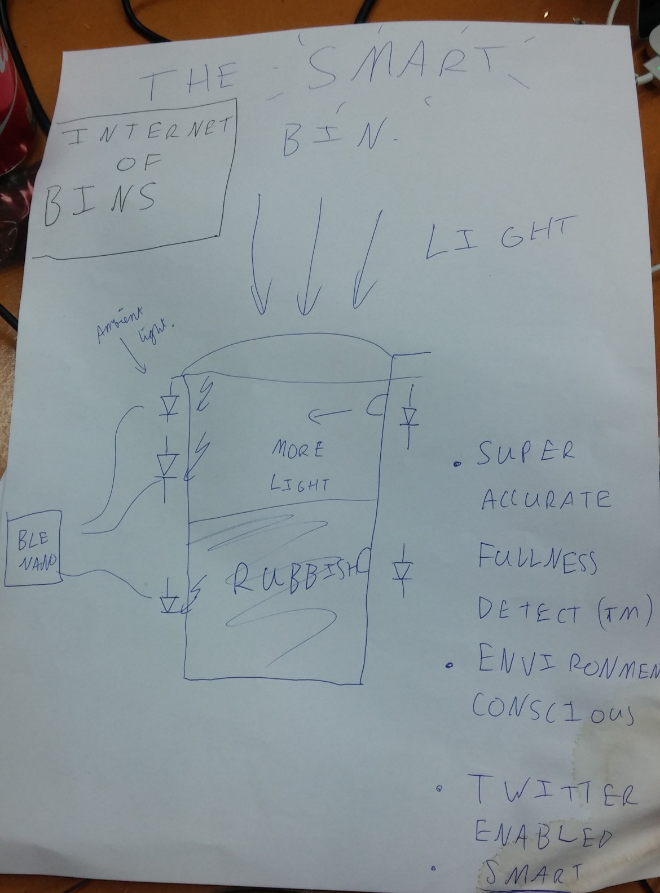
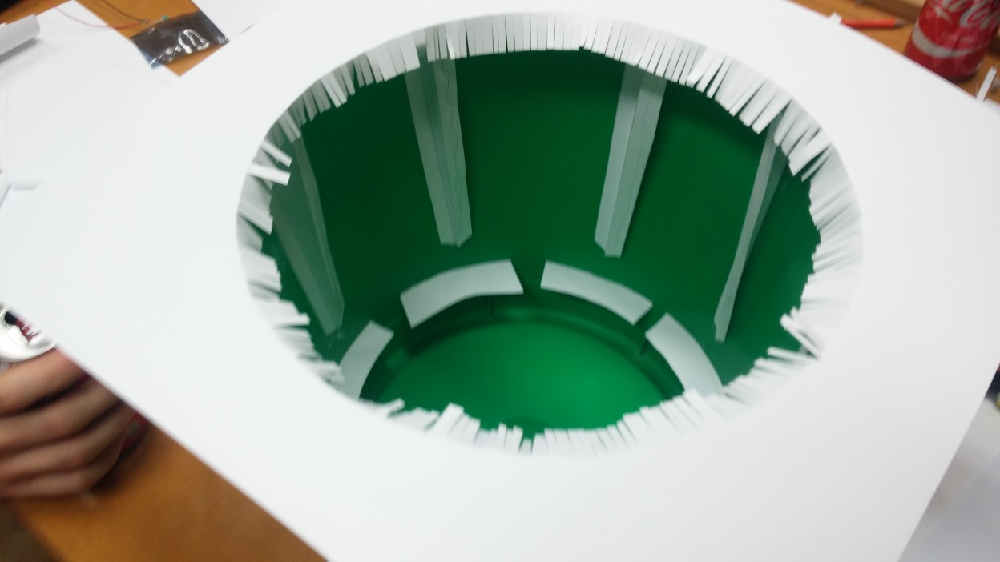
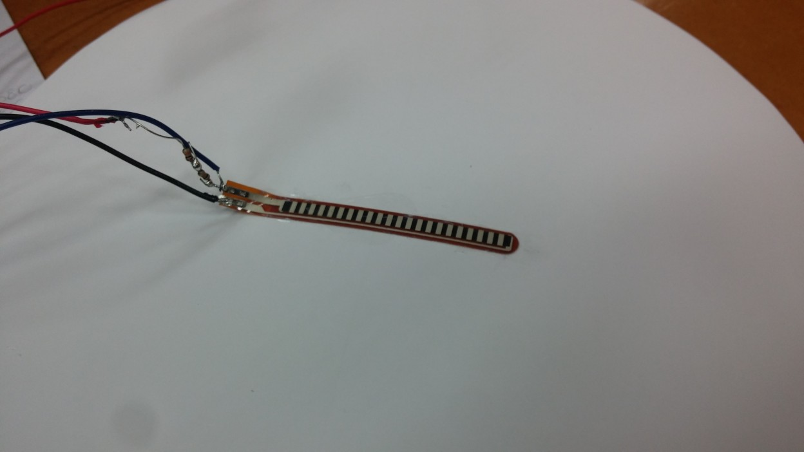
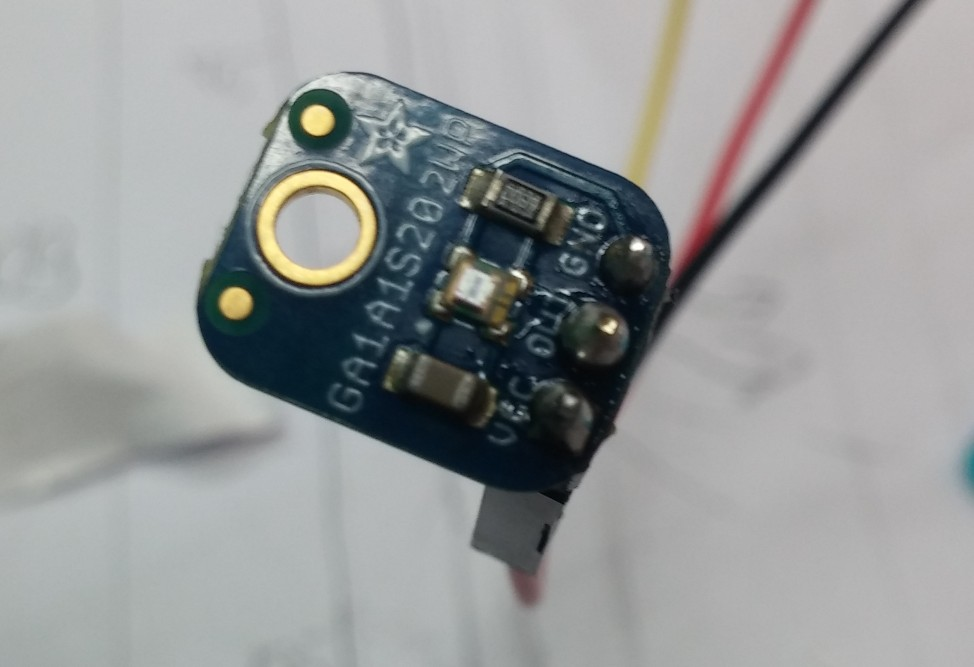
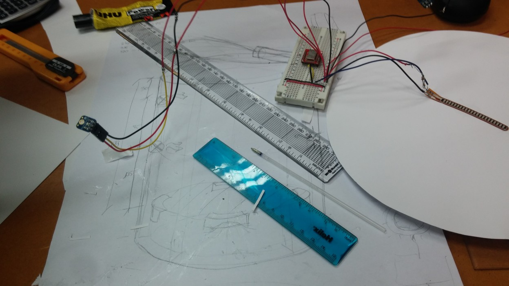
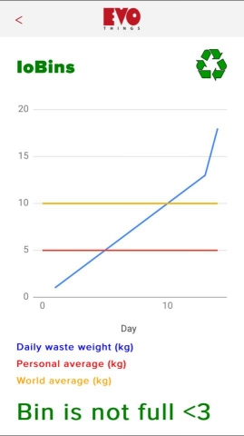
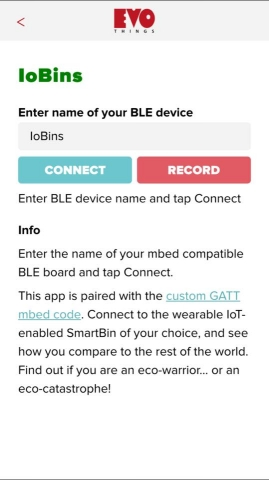
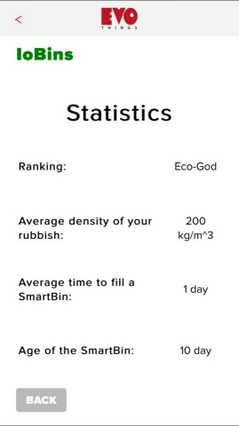
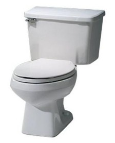

IoT Enabled Wearable SmartBin
=============================

The Project
-----------

[Watch on YouTube](https://youtu.be/SBOjNBrmgJc)

We developed a Bluetooth Low-Energy based Smart Bin, which measures the mass and volume of rubbish contained inside.



A companion smartphone app logs the data, renders beautiful graphs, and tweets passive-aggressively when the bin is full.

Hardware
--------

The project is based around a plastic bin we "found" in college. A BLE Nano provides Bluetooth Low-Energy connectivity and collects readings from the sensors.



We sense:

- Bending of the flexible base, using a carbon-composition resistive flex sensor
	- 
- Luminous intensity at different heights of the bin's wall
	- 

LEDs shine while light readings are being taken, so that light sensors work even whilst the lid is closed.

From this we determine:

- The mass of rubbish inside the bin (the cardboard prototype base measures up to 1/2 kg)
- Whether or not the bin is full (volume)

Much of the quiescent current is actually drawn in the biasing resistors for our resistive sensors (carbon composition flex, and CdS photo resistors). We would pursue this current before putting too much more effort into optimising the firmware for power consumption, e.g. by replacing the LDRs with back-biased LEDs.

We put the electronics together on a good old-fashioned breadboard.



Pinout:

```
P0_4: Top light sensor (analog in)
P0_5: Bottom light sensor (analog in)
P0_6: Flex sensor (analog in)
P0_7: LED illumination (output)
```

Software
--------





The software was hastily assembled from the following:

- BLE Nano firmware was written using the [mbed](https://developer.mbed.org/) framework and IDE.
	- This was our first time using mbed, but was quite pain-free.
	- There were some stumbling blocks. In particular, no obvious way of toggling a pin between high and low Z.
- The smartphone app was *mostly* written in HTML + JavaScript in [Evothings](https://evothings.com/) with Google Charts. *However*:
	- The walled garden web browser approach to app development was frustrating - it was fantastic until we wanted to do something that hadn't been done before in Evothings, i.e. send a tweet.
	- All existing JS code for this required Node.js which didn't seem to play nicely with Evothings.



In the end, we had a Python-based HTTP server running on the Macbook with Evothings, with its do_GET() method gutted to return 200 OK and tweet via TweePy.

The JS phone app initiates the tweet by making an HTTP GET to workbench_ip + ":8080".

This is perhaps better explained with the following visual aid:



*lots of plumbing*

Some Points of Interest
-----------------------

- Use of [oversampling](http://www.atmel.com/images/doc8003.pdf) to improve resolution for flex measurements, due to limited range of data.
- Creating an HTTP server in Python is *one line*: `import http.server`.
- This bin is technically wearable, as shown in our presentation.